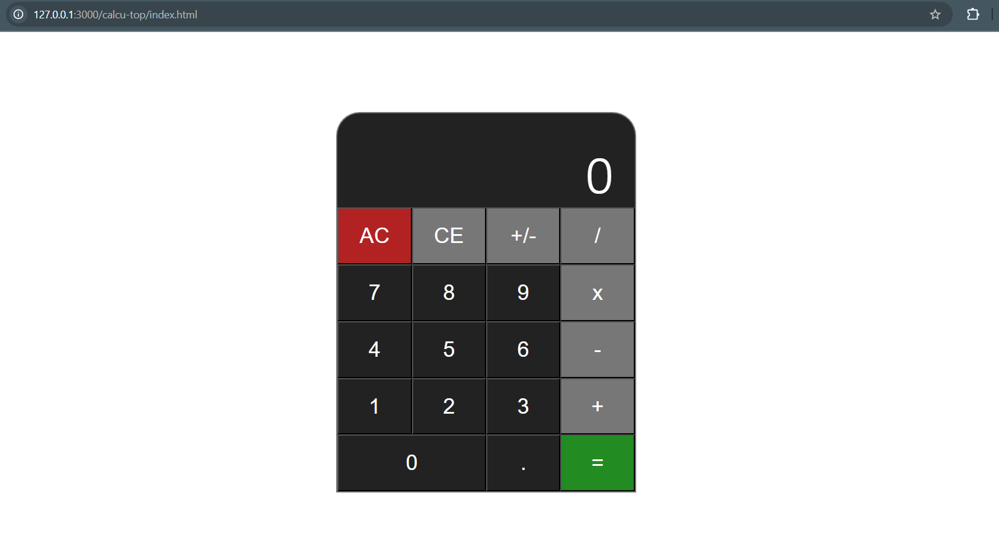

# Basic Calculator


A simple calculator page for one of The Odin Project's foundational courses.

- Purely Vanilla CSS (flex box).
- Simple JavaScript DOM manipulation and functions.

[](images/sample-view.png)

##

## Directory

The project has a _logic folder_ which contains the JS scripts.

   ```
    calcu-top
    ├── logic
    │   ├── calculator.js
    │   └── operation.js
    ├── styles
    │   └── buttons.css
    ├── images
    │   └── ...
    ├── index.html
    ├── README.md
    └── style.css
   ```


Reference: *https://www.theodinproject.com/lessons/foundations-calculator*
